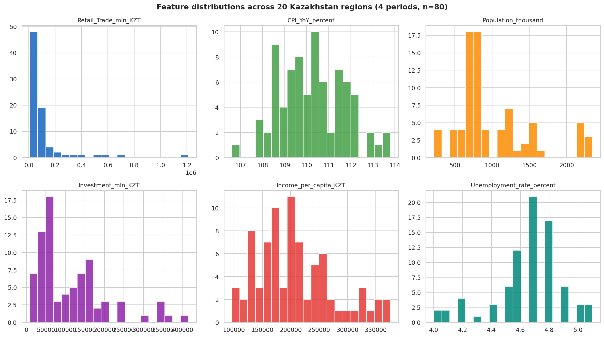
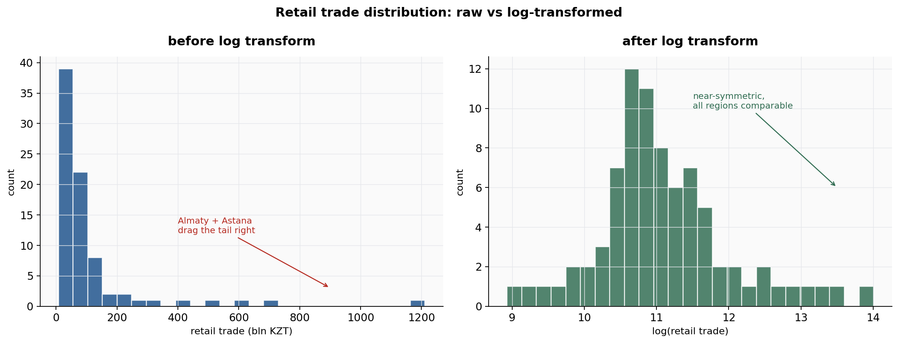
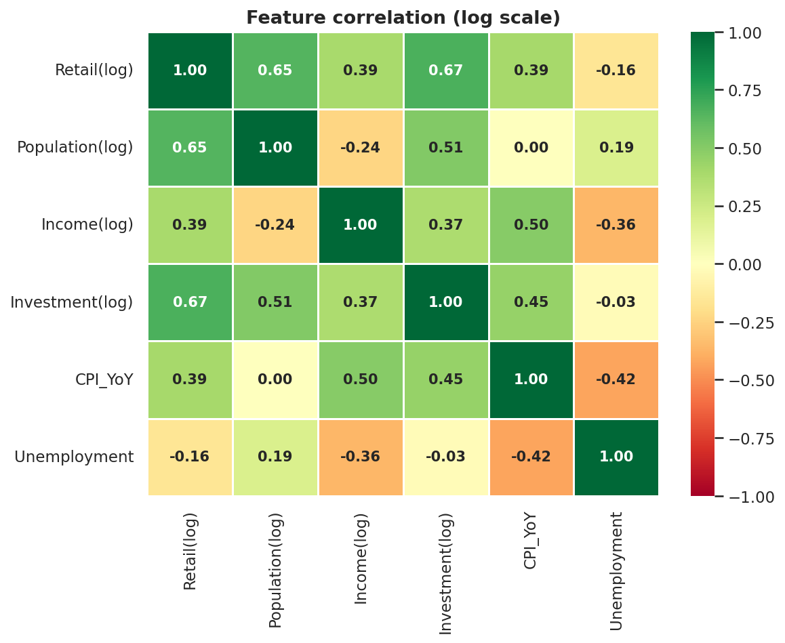
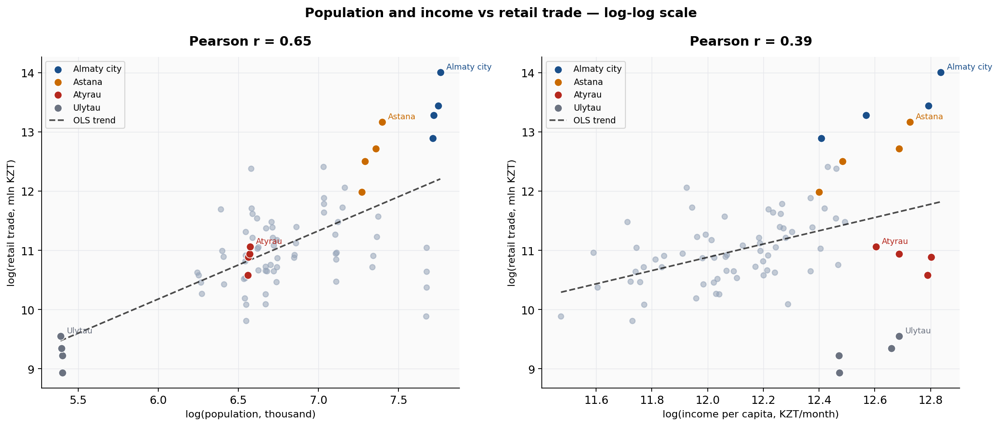
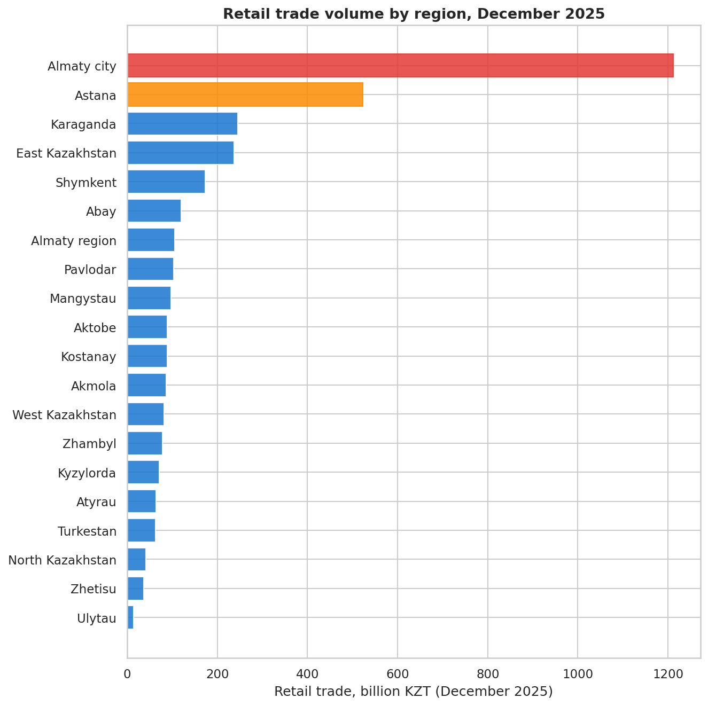
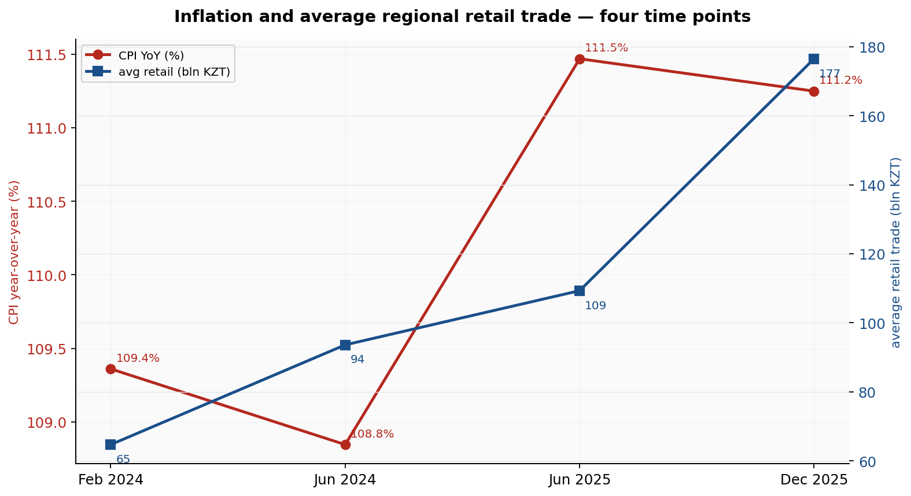
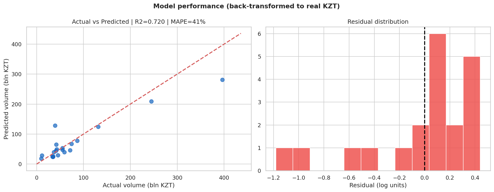
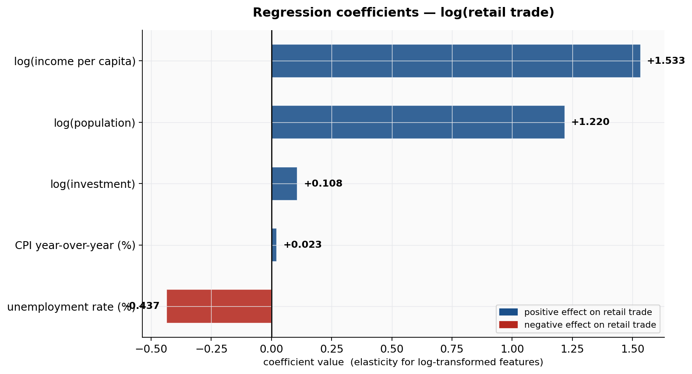

# Predicting Regional Retail Trade in Kazakhstan

A multiple linear regression analysis of monthly retail trade volume across Kazakhstan's 20 administrative regions. The dataset was compiled from four official monthly bulletins published by the Bureau of National Statistics of the Republic of Kazakhstan (stat.gov.kz), covering the period February 2024 to December 2025.

---

## Problem Statement

Retail trade volume serves as one of the more direct proxies for regional consumer activity. Unlike GDP, which aggregates many components and is reported annually, retail trade is measured monthly and reflects how much money households are actually spending in stores. That makes it a useful leading signal for regional economic health.

The question this project addresses is concrete: can the monthly retail trade volume of a Kazakhstani region be estimated from a small set of macroeconomic and demographic indicators - population, income per capita, inflation, capital investment, and unemployment? And if yes, which of those indicators carries the most weight, and why does the data produce that ranking rather than some other?

The choice of linear regression is deliberate. A gradient-boosted tree might predict slightly more accurately, but it would not answer the second question. Linear regression gives a direct, auditable answer: each coefficient states how much retail trade changes per unit change in one variable, with everything else held fixed.

---

## Dataset

| | |
|---|---|
| **Source** | Bureau of National Statistics of Kazakhstan ([stat.gov.kz](https://stat.gov.kz/)) |
| **Publication** | monthly bulletin "Socio-Economic Development of the Republic of Kazakhstan" |
| **Observations** | 80 (20 regions x 4 time periods) |
| **Time span** | February 2024 - December 2025 |
| **Target** | `Retail_Trade_mln_KZT` - monthly retail trade volume, million KZT |

Four bulletins were used: February 2024, June 2024, June 2025, and December 2025. Each bulletin reports the same set of indicators for all 20 regions, including the cities of Astana, Almaty, and Shymkent. Income and unemployment are published quarterly by the source rather than monthly; each monthly observation was matched to the nearest available quarter.

Full column definitions and direct PDF links are in [`data/DATA_DICTIONARY.md`](DATA_DICTIONARY.md).

---

## Exploratory Data Analysis

### Feature Distributions



Three variables - retail trade, population, and investment - show pronounced right-skew. The distribution of retail trade is the clearest example: the bulk of observations cluster below 100 bln KZT, while Almaty city exceeds 1.2 trillion KZT in December 2025, roughly 160 times the volume recorded in Ulytau.

This kind of skew is not a data quality issue - it reflects the actual structure of the Kazakhstani economy, where two or three urban centers concentrate a disproportionate share of economic activity. The problem it creates for linear regression is that a model fit on raw values will be pulled strongly toward explaining the variance of those outlier cities, at the expense of the relationship that holds across the other 18 regions. The log transformation addresses this directly.

CPI and unemployment are the exceptions: both are narrow, roughly symmetric, and require no transformation. Inflation ranged from 107.8% to 113.8% across the sample, and unemployment from 4.0% to 5.1%.

### Log Transformation



The left panel shows retail trade in raw units. The right shows log(retail trade). The difference is meaningful beyond aesthetics: after the transform, the distance between a 50 bln KZT region and a 100 bln KZT region is the same as the distance between 500 bln and 1 trillion - both represent a factor of two. This is the right scale for comparing regions that differ by orders of magnitude, and it is the scale on which the regression coefficients become interpretable as elasticities.

### Correlation Structure



Investment (r = 0.67) and population (r = 0.65) lead the correlation table, but the fact that they come out nearly equal is somewhat coincidental - they drive retail trade through different channels.

Population's correlation is high because retail trade is, at its most basic level, the sum of transactions made by individual people. More residents means a larger base of potential buyers. This relationship holds across regions with very different income levels and economic profiles, which is why it comes through strongly even in a diverse 20-region sample.

Investment's correlation is slightly higher than population's despite being a more indirect measure. The reason is that capital investment is a proxy for something broader: regions that attract large capital flows are generally regions where the overall economy is expanding - new logistics infrastructure, commercial real estate, manufacturing. That expansion affects not just investment itself but employment, income, and consumer confidence at the same time. A high investment figure is therefore correlated with a cluster of growth signals, not just one, which amplifies its correlation with retail trade.

Income per capita (r = 0.39) comes in lower than might be expected, given that spending is ultimately constrained by income. The explanation is that the correlation is measured across all 80 observations simultaneously, including across different time periods. Atyrau, for instance, consistently reports some of the highest income per capita in the country due to its oil sector, but its retail trade volume is moderate relative to that income level - a substantial portion of oil-sector earnings does not cycle through local stores. That divergence compresses the overall correlation coefficient.

Unemployment (r = -0.16) shows the weakest effect. The range of unemployment across Kazakhstan's regions is genuinely narrow (4.0-5.1%), which means there is not much statistical variation to work with. The true relationship between unemployment and spending is likely stronger than this number suggests - the data simply doesn't have enough spread in that variable to detect it clearly.

### Population and Income vs. Retail Trade



The left panel confirms the population relationship is close to linear in log-log space - the OLS trend line fits tightly across the range. The slope being above 1 (the elasticity estimated by the model is 1.22) means that doubling a region's population is associated with more than doubling its retail trade. That excess over 1 reflects agglomeration: large cities generate retail traffic from surrounding areas, operate more diverse retail formats, and sustain higher commercial density than smaller regions.

The right panel shows income per capita on a log scale. Atyrau's position is the clearest anomaly - it sits well to the right of the trend (high income) but close to the trend on the vertical axis (retail trade in line with its population, not its income). This gap between high income and moderate local spending is consistent with an economy where a large portion of income derives from capital-intensive extraction industries that employ relatively few people at high wages, rather than from broad-based employment that drives consumer activity across the population.

### Regional Comparison



In December 2025, Almaty's retail trade exceeded Astana's by a factor of approximately 2.3, despite a population ratio closer to 1.4. The gap is not primarily demographic. Almaty has historically concentrated Kazakhstan's wholesale and retail infrastructure - major distribution centers, established retail chains, and international brand presence - that were built before Astana became the capital in 1997 and have not relocated. Consumers from surrounding oblasts travel to Almaty for purchases that are unavailable locally, which further inflates its retail figures relative to its resident population.

### Inflation and Average Sales Over Time



Between February 2024 and December 2025, average regional retail trade nearly doubled in nominal terms. Inflation over the same period was running at approximately 110-113% year-over-year, which means a significant share of that nominal growth reflects higher prices rather than a larger volume of goods sold. This distinction matters for interpreting the CPI coefficient in the model: what looks like growing retail trade is partly the same goods priced higher.

The dual-axis chart makes one structural point clear: the upward trend in nominal retail trade is consistent across all four time points, while CPI oscillates in a narrower band. The divergence between the two series - retail growing faster than inflation alone would predict - does suggest some real consumption growth over the period, but the model works in nominal terms throughout and cannot separate the two effects.

---

## Model

```
model:    LinearRegression (scikit-learn)
features: log(population), log(income per capita), CPI YoY %,
          log(investment), unemployment rate %
target:   log(retail trade)
split:    75% train / 25% test, random_state=42
```

### Results

| metric | train | test |
|---|---|---|
| MAE (log units) | 0.357 | 0.330 |
| RMSE (log units) | 0.471 | 0.439 |
| **R²** | 0.741 | **0.720** |

5-fold cross-validation R²: mean = 0.530, std = 0.322 (per-fold: 0.76, 0.25, 0.72, 0.88, 0.05)

in real KZT: test-set MAE approximately 21 bln KZT, MAPE approximately 41%

R² is used as the primary metric for comparing train and test performance. MAE and RMSE are both reported but cannot be compared directly to each other because they aggregate errors differently. R² has a fixed [0, 1] scale that is consistent across both sets.



A test R² of 0.72 means the model captures roughly 72% of the variance in log(retail trade) using five inputs. The gap between train and test is small (0.741 vs 0.720), which indicates the model is generalizing rather than overfitting the training sample.

The residual distribution is approximately symmetric around zero, which confirms there is no systematic directional bias - the model is not consistently over- or under-predicting for any obvious structural reason. The cross-validation scores span a wide range (0.05 to 0.88), which reflects a genuine limitation of the sample size rather than model instability. With 80 observations representing only 20 independent regions, any single fold can end up with a skewed composition that inflates or deflates the R² for that fold.

---

## Coefficient Interpretation



For the four log-transformed features, each coefficient is an elasticity: the percentage change in retail trade associated with a 1% change in that feature, with all others held constant. CPI and unemployment remain in original percentage-point units, so their coefficients represent the absolute change in log(retail trade) per one percentage-point shift.

| feature | coefficient | what it means |
|---|---|---|
| log(income per capita) | +1.53 | a 1% rise in regional income is associated with a 1.53% rise in retail trade. the elasticity exceeds 1 because discretionary spending - restaurants, electronics, clothing - grows faster than income, while spending on basic necessities is relatively flat. as income rises, a larger share of it goes to categories with high unit value. |
| log(population) | +1.22 | an elasticity above 1 means larger regions are not just proportionally larger retail markets, they are disproportionately larger ones. this is consistent with agglomeration effects: major cities draw retail traffic from outside their administrative boundaries, run more diverse retail formats, and sustain commercial infrastructure that smaller regions cannot support. |
| unemployment rate | -0.44 | exponentiating this gives exp(-0.437) = 0.65, meaning a one percentage-point increase in unemployment is associated with retail trade being approximately 35% lower. this is the only negative coefficient in the model. the mechanism is direct: unemployment reduces household income, which reduces the budget available for consumption. |
| log(investment) | +0.11 | the weakest of the significant effects. fixed capital investment affects consumption through job creation and infrastructure, not immediately. a new logistics center or factory takes months to years before it generates employment income that flows into local retail spending. within a single monthly snapshot, the contemporaneous effect is small. |
| CPI YoY % | +0.02 | each additional percentage point of inflation corresponds to approximately 2.3% higher nominal retail trade, once population, income, investment, and unemployment are held constant. the effect is small because most of the inflation signal is already absorbed into the time dimension of the data - prices rose across all regions simultaneously, so it shows up in period-to-period trends rather than cross-regional variation. |

---

## Limitations

**effective sample size.** the dataset has 80 rows, but 20 of those regions each appear 4 times. observations from the same region across periods are correlated - Almaty in February 2024 and Almaty in December 2025 share the same fundamental economic structure. the effective number of independent units is closer to 20 than 80, which is what the cross-validation variance is reflecting.

**nominal prices throughout.** retail trade is reported in current prices. the model does not separate real volume growth from inflation-driven nominal growth. deflating retail trade by CPI before modeling would isolate the real consumption signal, but that transformation was not applied here.

**no interaction terms.** the model assumes that the effect of income on retail trade is the same in every region. the actual relationship likely differs between a city like Almaty, where a high-income household might spend primarily on services and premium goods, and a rural region where that same income increase shifts spending toward durable goods and food. a linear model averages these into one coefficient.

**seasonality not controlled.** the four observation periods fall in February, June, and December. December retail trade is typically higher than June or February due to holiday spending. this seasonal signal is not isolated in the current setup, which could be affecting the CPI and investment coefficients in particular.

**unemployment range is too narrow to draw firm conclusions.** regional unemployment across the four periods sits between 4.0% and 5.1%. in a dataset where a key variable only moves within a 1.1 percentage-point range, even a strong underlying relationship will produce a weak estimated coefficient. the -0.44 figure should be read as directionally correct but not as a precise magnitude estimate.

---

## Suggested Extensions

Monthly observations over two or three years, rather than four snapshots, would increase the effective sample size and stabilize the cross-validation results. Deflating the retail trade target by regional CPI would allow the model to target real consumption growth. Regional fixed effects would control for time-invariant structural differences between oblasts. Comparing this linear specification against a Random Forest or Ridge regression would test whether the assumed linearity is an adequate approximation.

---

## Stack

```
python 3.12
pandas, numpy       - data wrangling
matplotlib, seaborn - visualization  
scikit-learn        - LinearRegression, train_test_split, KFold, metrics
```

## Repository Structure

```
.
├── data/
│   ├── kazakhstan_regional_retail_trade.csv
│   └── DATA_DICTIONARY.md
├── notebooks/
│   └── kazakhstan_retail_regression.ipynb
├── images/
│   ├── 1_distributions.png
│   ├── 1b_log_transform.png
│   ├── 2_correlation.png
│   ├── 3_scatter_population_income.png
│   ├── 4_regions_dec2025.png
│   ├── 5_cpi_trend.png
│   ├── 6_actual_vs_predicted.png
│   └── 7_coefficients.png
├── requirements.txt
└── README.md
```

## Usage

```bash
git clone https://github.com/<your-username>/kazakhstan-retail-trade-regression.git
cd kazakhstan-retail-trade-regression
pip install -r requirements.txt
jupyter notebook notebooks/kazakhstan_retail_regression.ipynb
```

## Sources

bureau of national statistics of the republic of Kazakhstan - [stat.gov.kz](https://stat.gov.kz/). direct links to all four source bulletins are in [`data/DATA_DICTIONARY.md`](data/DATA_DICTIONARY.md).
